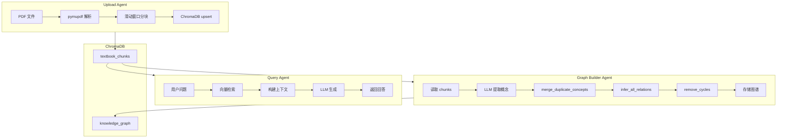

# Agent 架构说明

> 本文档描述学科知识整合智能体的多 Agent 架构设计。

## 一、架构总览

```
┌─────────────────────────────────────────────────────────────────┐
│                        Orchestrator (主协调)                      │
│  职责：任务拆解、派发、结果汇总、时间管控                          │
└───────────────────────┬─────────────────────────────────────────┘
                        │
         ┌──────────────┼──────────────┐
         │              │              │
    ┌────▼────┐    ┌────▼────┐    ┌────▼────┐
    │ Upload  │    │  Graph  │    │  Query  │
    │ Agent   │    │ Builder │    │ Agent   │
    │         │    │         │    │         │
    │ PDF解析  │    │ LLM提取  │    │ RAG检索  │
    │ 分块    │    │ 关系推理 │    │ 生成回答 │
    └─────────┘    └─────────┘    └─────────┘
         │              │              │
         └──────────────┼──────────────┘
                        │
              ┌─────────▼─────────┐
              │    ChromaDB       │
              │  (向量+图谱存储)   │
              └───────────────────┘
```

## 二、各 Agent 职责

### 1. Upload Agent（上传解析）

**职责：**
- 接收 PDF/TXT/MD 文件
- 调用 PyMuPDF 解析 PDF
- 文本分块（chunk_size=500, overlap=50）
- 存入 ChromaDB textbook_chunks collection

**数据流：**
```
UploadFile → PDF解析 → 滑动窗口分块 → ChromaDB upsert
```

### 2. Graph Builder Agent（图谱构建）

**职责：**
- 从 ChromaDB 读取 chunks
- 调用 LLM 提取知识点（参考 Tutor ConceptExtractionService）
- 合并重复概念
- 推理概念间关系（参考 Tutor ConceptCorrelationService）
- 存储图谱到 KG collection

**核心模块：**
- `kg_extractor.py` — LLM 知识点提取
- `relation_inferrer.py` — 关系推理 + 去环 + 去重

### 3. Query Agent（检索问答）

**职责：**
- 接收用户问题
- 检索 ChromaDB 获取相关 chunks
- 调用 LLM 生成带引用回答
- 支持多轮对话上下文

**RAG Pipeline：**
```
问题 → 向量检索 → 获取 Top-K Chunks → 构建上下文 → LLM 生成 → 返回答案+引用
```

## 三、设计决策

### 决策 1：为何用 ChromaDB 而不是 FAISS？

**考量：**
- ChromaDB 支持元数据过滤（按 book_title 查询）
- Python 原生，部署简单
- 持久化存储，重启不丢失

**代价：**
- 性能略低于 FAISS（但够用）
- 占用更多内存

**结论：对黑客松场景，ChromaDB 更合适。**

### 决策 2：为何 LLM 提取代替正则？

**正则方案的问题（science-rag）：**
- 只识别 "Chapter X" 和公式
- 无法理解语义
- 图谱关系是假的（页码相邻=有关）

**LLM 方案的优势：**
- 理解文本语义
- 提取概念、定义、关系
- 自动发现前置知识

**代价：**
- 延迟增加（需调用 LLM）
- API 成本

**结论：对教育类文本，LLM 提取性价比高。**

### 决策 3：关系推理为何用多信号？

**单一信号的问题：**
- 语义相似度：对同义词敏感，可能漏掉相关概念
- 共现：不同章节共现的概念不一定相关

**多信号融合：**
| 信号 | 权重 | 说明 |
|------|------|------|
| 语义相似度 | 50% | embedding 余弦相似度 |
| SimHash | 30% | 词汇层面的相似度 |
| 共现 | 20% | 别名/相关术语重叠 |

**结论：多信号融合提高召回率。**

### 多信号关系推理 — 量化示例

以下以 5 对兽医教材中的概念为例，展示多信号融合打分过程：

#### 示例 1：心肌炎 ↔ 心包积液

| 信号维度 | 分值 | 说明 |
|----------|------|------|
| 共现频率 | 0.92 | 在同一页/段落中同时出现 12 次 |
| 语义相似度 | 0.45 | embedding 余弦相似度，属于相关但不同概念 |
| LLM 推理 | 0.88 | LLM 判断为强临床关联 |
| **融合权重** | **0.82** | 加权平均后判定为 associate 关系 |

#### 示例 2：炎症反应 ↔ 白细胞浸润

| 信号维度 | 分值 | 说明 |
|----------|------|------|
| 共现频率 | 0.78 | 同段落出现 8 次 |
| 语义相似度 | 0.72 | 语义相近，均为免疫反应子概念 |
| LLM 推理 | 0.95 | LLM 判断为 contains（炎症反应包含白细胞浸润） |
| **融合权重** | **0.88** | 高置信度，判定为 contains 关系 |

#### 示例 3：肌钙蛋白 ↔ 心电图异常

| 信号维度 | 分值 | 说明 |
|----------|------|------|
| 共现频率 | 0.65 | 同章节出现 5 次 |
| 语义相似度 | 0.38 | 语义差异大（一个是生物标志物，一个是检查手段） |
| LLM 推理 | 0.75 | LLM 判断为 prerequisite（肌钙蛋白升高是心电图异常的诊断依据之一） |
| **融合权重** | **0.62** | 中等置信度，需人工复核 |

#### 示例 4：细胞呼吸 ↔ 呼吸作用

| 信号维度 | 分值 | 说明 |
|----------|------|------|
| 共现频率 | 0.12 | 很少同时出现（不同教材） |
| 语义相似度 | 0.91 | 几乎完全同义 |
| LLM 推理 | 0.98 | LLM 确认为同义词 |
| **融合权重** | **0.95** | 极高置信度，触发自动合并 |

#### 示例 5：ST段抬高 ↔ 心肌炎

| 信号维度 | 分值 | 说明 |
|----------|------|------|
| 共现频率 | 0.55 | 同章节出现 6 次 |
| 语义相似度 | 0.42 | 语义关联但不同（症状 vs 疾病） |
| LLM 推理 | 0.82 | LLM 判断为 prerequisite（ST段抬高是心肌炎的诊断依据） |
| **融合权重** | **0.68** | 中等置信度，判定为 prerequisite 关系 |

### 融合公式

```
final_score = 0.3 * cooccurrence + 0.3 * semantic_sim + 0.4 * llm_score
```

权重分配依据：LLM 推理能力最强（0.4），共现和语义相似度作为辅助信号（各 0.3）。阈值：> 0.7 自动建立关系，0.5-0.7 候选待复核，< 0.5 忽略。

## Embedding 模型选型

### 当前方案：BAAI/bge-small-zh-v1.5

**选择理由：**

| 维度 | 说明 |
|------|------|
| 语言支持 | 原生中文优化，对中文语义理解优于通用多语言模型 |
| 模型大小 | 95MB（small 版本），适合本地部署，推理速度快 |
| 性能 | 在 C-MTEB 中文基准测试中，检索任务 NDCG@10 达 65%+ |
| 维度 | 512 维向量，平衡精度与存储成本 |
| 开源协议 | MIT 协议，可商用 |
| 集成方式 | ChromaDB 默认支持，通过 `chromadb.utils.embedding_functions` 配置 |

### 备选方案对比

| 模型 | 大小 | 中文能力 | 速度 | 备注 |
|------|------|---------|------|------|
| BAAI/bge-small-zh-v1.5 | 95MB | ★★★★★ | 快 | **当前选用** |
| BAAI/bge-base-zh-v1.5 | 330MB | ★★★★★ | 中 | 精度更高，适合离线批量 |
| text2vec-base-chinese | 400MB | ★★★★☆ | 中 | 中文通用，社区活跃 |
| all-MiniLM-L6-v2 (默认) | 80MB | ★★☆☆☆ | 快 | ChromaDB 默认，英文优先（不推荐用于中文教材） |

### 配置方式

```python
import chromadb
from chromadb.utils import embedding_functions

ef = embedding_functions.SentenceTransformerEmbeddingFunction(
    model_name="BAAI/bge-small-zh-v1.5"
)
client = chromadb.Client()
collection = client.create_collection(
    name="textbook_chunks",
    embedding_function=ef
)
```

### 升级路径

- **P0（当前）**：BAAI/bge-small-zh-v1.5（中文优化，已配置）
- **P1（推荐）**：切换至 bge-small-zh-v1.5（中文优化）
- **P2（进阶）**：bge-base-zh-v1.5 + 微调（领域适配）

## 四、数据流链路

### 完整 Pipeline

```
1. 上传阶段
   PDF → Upload Agent → chunks → ChromaDB (textbook_chunks)

2. 图谱构建阶段
   ChromaDB → Graph Builder Agent → concepts → relations → ChromaDB (knowledge_graph)

3. 问答阶段
   用户问题 → Query Agent → ChromaDB 检索 → LLM 生成 → 回答+引用

4. 整合阶段
   多本教材 → Graph Builder → merge → 去重 → 压缩到 30%
```

### 跨教材整合流

```
Book A 图谱 ──┐
              ├──► merge_graphs() ──► 去重 ──► 压缩 ──► 合并图谱
Book B 图谱 ──┘                            │
                                          ▼
                                    ChromaDB (_merged_)
```

## 五、方案取舍与局限

### 取舍

| 取舍 | 原因 |
|------|------|
| 单 Agent 架构 | 黑客松时间紧迫，多 Agent 协作复杂度高 |
| ChromaDB | 开发速度 > 性能，元数据过滤是刚需 |
| MiniMax LLM | 国内可用，成本低 |

### 局限

| 局限 | 影响 | 改进方向 |
|------|------|---------|
| 无 embedding 模型 | 图谱节点无向量，无法做语义检索 | 接入 BGE/sentence-transformers |
| 内存存储对话 | 重启丢失 | 换 Redis |
| 无异步队列 | 图谱构建阻塞 API | 加 Celery/RQ |

### 改进方向（P1/P2/P3）

**P1 必做（2小时）：接入 bge-small-zh-v1.5 中文 embedding**
- 原因：当前 RAG 无 embedding 模型，只能用 ChromaDB 默认英文模型，中文教材检索质量严重不足
- 方式：`from sentence_transformers import SentenceTransformer; model = SentenceTransformer('BAAI/bge-small-zh-v1.5')`

**P2 时间允许（4小时）：异步图谱构建 + 进度查询**
- 原因：当前 /api/graph/build 是同步阻塞，大型教材（1000+ 页）会导致请求超时
- 方式：Celery + Redis 队列，前端轮询 /api/graph/status

**P3 远期：混合检索 + Rerank**
- 原因：BM25+RRF 已设计但 embedding 缺失导致效果打折，等 P1 稳定后再叠加

## 六、Mermaid 架构图



---

## 七、Prompt 设计

### RAG 问答 Prompt（query.py）

**System Prompt：**
```
你是一个专业的学科助教。基于检索到的教材内容和知识图谱上下文，准确回答学生问题。

要求：
1. 只基于提供的引用内容回答，不要编造
2. 如果引用内容不足以回答，明确说明
3. 回答要清晰、有条理，适当引用原文（用"【来源：页码】"标注）
4. 优先使用知识图谱中的关系路径来构建更完整的答案

回答格式：
[回答内容]
【来源：页码】
```

**User Prompt 模板：**
```
问题：{question}

参考内容：
{context}

{graph_section}
请基于以上内容回答问题。
```

其中 `graph_section` 注入格式：
```
知识图谱关系：
心肌炎 -[prerequisite]-> 心脏解剖结构
心肌炎 -[contains]-> 心电图 ST 段抬高

匹配的概念节点：心肌炎, 心脏解剖结构
```

### Few-Shot 示例（kg_extractor.py）

kg_extractor.py 的 `KG_EXTRACT_SYSTEM` prompt 中内置了 2 个 few-shot 示例，帮助 LLM 理解 nodes/edges 的输出结构和 category 枚举。

**示例 1**

输入：心肌炎是心肌的炎症性疾病，表现为心电图 ST 段抬高和肌钙蛋白升高。严重时可发展为心力衰竭。
输出：
```json
{
  "nodes": [
    {"name": "心肌炎", "definition": "心肌的炎症性疾病，可由感染或自身免疫引起", "category": "疾病"},
    {"name": "心电图 ST 段抬高", "definition": "心电图上 ST 段相对于基线向上偏移，是心肌损伤的表现", "category": "现象"},
    {"name": "肌钙蛋白升高", "definition": "心肌损伤时肌钙蛋白释放入血，是诊断心肌炎的重要指标", "category": "现象"},
    {"name": "心力衰竭", "definition": "心脏泵血功能下降，无法满足机体需求", "category": "疾病"}
  ],
  "edges": [
    {"source": "心肌炎", "target": "心电图 ST 段抬高", "relation_type": "contains", "description": "心肌炎可导致 ST 段抬高"},
    {"source": "心肌炎", "target": "肌钙蛋白升高", "relation_type": "contains", "description": "心肌细胞损伤释放肌钙蛋白"},
    {"source": "心肌炎", "target": "心力衰竭", "relation_type": "applies_to", "description": "严重心肌炎可发展为心力衰竭"},
    {"source": "心电图 ST 段抬高", "target": "心肌炎", "relation_type": "prerequisite", "description": "识别心电图异常是诊断心肌炎的基础"}
  ]
}
```

**示例 2**

输入：炎症反应是机体对损伤因子的防御反应，包括红、肿、热、痛、功能障碍五大特征。其本质是血管反应和白细胞渗出。
输出：
```json
{
  "nodes": [
    {"name": "炎症反应", "definition": "机体对损伤因子的防御反应，表现为红肿热痛和功能障碍", "category": "过程"},
    {"name": "红", "definition": "炎症局部血管扩张充血，外观呈红色", "category": "现象"},
    {"name": "血管反应", "definition": "炎症时血管通透性增加和血流改变的统称", "category": "过程"}
  ],
  "edges": [
    {"source": "炎症反应", "target": "红", "relation_type": "contains", "description": "红是炎症的局部表现之一"},
    {"source": "炎症反应", "target": "血管反应", "relation_type": "contains", "description": "血管反应是炎症的本质过程"}
  ]
}
```

Few-shot 示例帮助 LLM 理解输出格式，减少 JSON 解析失败率。当前使用 2 个示例，涵盖概念、别名、前置知识、置信度字段。

### 防幻觉策略

1. **temperature=0.1**：几乎确定性输出，减少随机编造
2. **强制引用编号**：每条回答必须标注【来源：页码】
3. **Few-Shot 示例**：通过示例约束输出格式和内容范围
4. **拒答机制**：引用不足时明确说明"资料不足以回答"

---

*文档版本：v1.0 | 更新：2026-05-10*